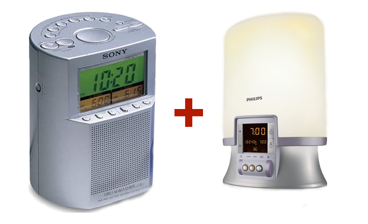

In honor of the original Sony Dream Machine
-------------------------------------------

Sony makes a lot of nice alarm clocks. The best alarm clock they made is this specific iteration of the Dream Machine. It is super-simple to set alarms, has a good sounding radio, and does not require any setup because it receives the time through DCF. I have had this alarm clock for about 20 years, but it is starting to give up on me. The radio stopped working. I tried to "re-cap" it, to but it didn't help. So now it only tells time and goes "beep".

Next to the Sony Dream Machine, I have a Phillips Wake-up light. I am farily sensitive to getting up in the dark, my Circadian Rhythm is apparently easy to get confused in the winter, which leads to grumpyness in the morning and extreme exhaustion around 15:00 in the afternoon. With the Wake-up light, this is significantly less. These two alarm clocks currently produce the following wake-up programme for me:

| time | event |
|--|--|
| 06:30 | The Phillips Wake-up light starts it's 30 minute sunrise sequence. |
| 06:50 | The Sony Dream Machine turns on the radio, gently nudging me to wake up. Usually this wakes me up and I listen to music and the news to start my day. |
| 07:05 | After the news, if I am still asleep, the Sony Dream Machine starts beeping. First gentle beeps, but slowly getting more persistant. |

It is hard to find an alarm clock which combines all these functions, doesn't look all that ugly and is easy and obvious to operate. So here I am, building one myself as a side project.

The base components for this project are:

- An [Arduino Mega](https://store.arduino.cc/arduino-mega-2560-rev3). Please note that if you use a different Arduino, get one with a true crystal oscillator, or else the [Blinkenlight DCF77 Library](https://blog.blinkenlight.net/experiments/dcf77/dcf77-library/) won't work properly.
- A [DS1302 Real Time Clock](https://www.kolkataonweb.com/code-bank/arduino/ds-1302-rtc-clock-module-for-arduino/) module to store the correct time even if we loose power or reception of DCF77 fails.
- A [2.7" OLED Display with SSD1325 driver](https://www.aliexpress.com/item/2-7-inch-20PIN-Yellow-OLED-Display-Screen-Module-SSD1325-Drive-IC-128-64-SPI-8Bit/32333238671.html) so that we can create any clock face without having residual backlight in black regions.
- A [TEA5767 FM Stereo Radio Module](https://www.aliexpress.com/item/Free-shipping-TEA5767-FM-Stereo-Radio-Module-for-Arduino-76-108MHZ-With-Free-Cable-Antenna/32274370479.html). You know, for radio.
- A bunch of [NeoPixels with a Warm White led](https://www.aliexpress.com/item/1m-2m-3m-4m-5m-SK6812-Similar-WS2812-WS2812B-Led-Strip-RGBCW-RGBNW-RGBWW-Individually-Addressable/32798226524.html). Please note you need the RGBWW (Red, Green, Blue, Warm white) modules so that we can create a proper sunrise from orange-red all the way to bright yellow. If you like a blue, colder daylight then you need the RGBCW Cold Wihte versions of these LEDs.

